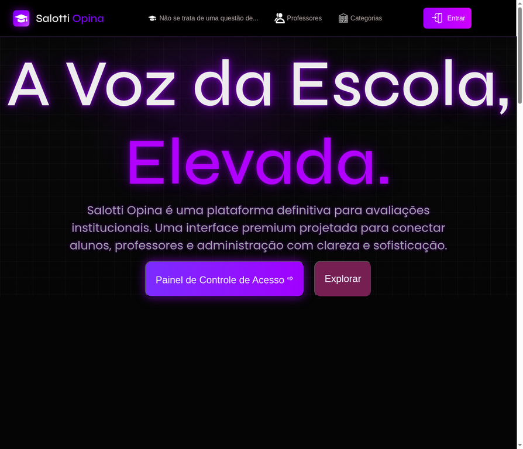
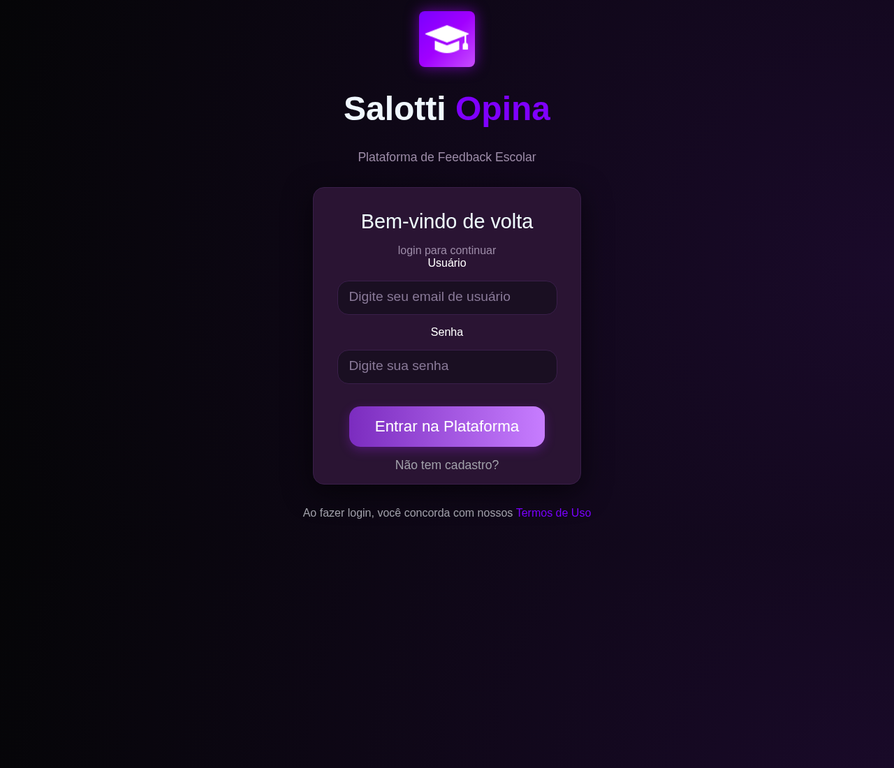
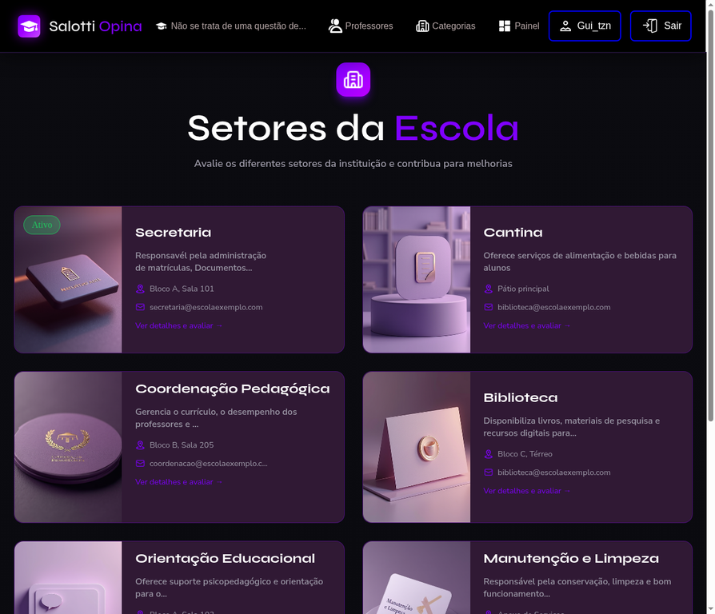

# 🎓 Salotti Opina

<p align="center">
  
  
  
</p>

<p align="center">
  <strong>🚀 A plataforma definitiva de feedback institucional escolar</strong><br>
  Desenvolvida para modernizar a comunicação entre alunos, professores e gestão escolar.
</p>

---

# 📌 Visão Geral

O **Salotti Opina** é uma plataforma web premium criada para transformar a forma como a escola recebe avaliações e sugestões.

Com uma interface moderna e intuitiva, alunos podem avaliar setores, professores e serviços internos, enquanto a administração utiliza os dados para melhorias contínuas.

---

# ✨ Diferenciais do Projeto

✅ Design moderno e profissional  
✅ Sistema completo de login  
✅ Avaliação de setores escolares  
✅ Área para professores  
✅ Dashboard administrativo  
✅ Feedback inteligente  
✅ Interface responsiva  
✅ Navegação rápida e intuitiva  
✅ Banco de dados integrado  

---

# 📸 Demonstração do Sistema

## 🏠 Página Inicial

<p align="center">
  
</p>

---

## 🔐 Tela de Login

<p align="center">
  
</p>

---

## 🏫 Setores da Escola

<p align="center">
  
</p>

---

# 🛠️ Tecnologias Utilizadas

<p align="center">


</p>

---

# 🎯 Objetivo do Projeto

Criar uma plataforma moderna e eficiente para dar voz aos alunos, gerar relatórios estratégicos e apoiar a gestão escolar em decisões importantes.

---

# 👨‍💻 Equipe Oficial

| Integrante | Função | GitHub |
|-----------|--------|--------|
| Vinicius Santos | Banco de Dados | https://github.com/ViniSantosC |
| Ryan Matos | Back-end | https://github.com/RyanM28S |
| Lucas | Back-end | Adicionar GitHub |
| Guilherme Bueno | Front-end | Adicionar GitHub |
| Patrick Eduardo | Gerente de Projeto | Adicionar GitHub |

---

# 📊 Estrutura do Sistema

```bash
SALOTTI1/
│── backend/
│── frontend/
│── database/
│── assets/
│── README.md
